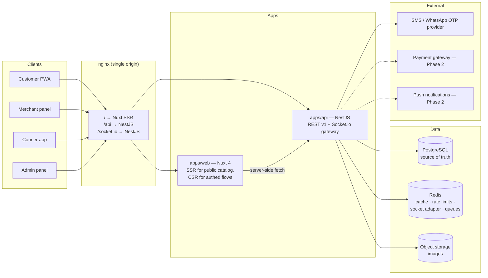

# 01 — System Overview

> Status: Draft v0.1 • Last updated: 2026-07-29
> Related: [02-domain-model-and-erd](02-domain-model-and-erd.md) • [07-service-extensibility](07-service-extensibility.md) • [10-conventions-and-structure](10-conventions-and-structure.md)

## 1. Vision

SprintGo is a multi-vertical local commerce marketplace (Egypt, ar-EG first). Two hard product constraints shape every technical decision:

1. **Radical simplicity** — customers and merchants may be elderly and non-technical. Every flow must survive the "can my grandmother do this unaided?" test.
2. **Ecosystem, not an app** — new service verticals (pharmacy, home services, …) must be added with configuration + small strategy classes, never a rewrite.

## 2. Actors

| Actor | Arabic | Primary device | Core jobs |
|-------|--------|----------------|-----------|
| Customer | العميل | Mobile browser | Find store → order → track → reorder |
| Merchant | صاحب المحل | Mobile/tablet browser | Hear new order → one-tap accept → mark ready/dispatched → manage products |
| Courier | مندوب التوصيل | Mobile browser | Go available → get assignment → pick up → deliver → cash handling per ADR-011 |
| Admin / Ops (incl. Dispatcher) | الإدارة | Desktop | Approve stores, manage verticals/zones, **assign couriers (dispatch board)**, oversee orders, audit |

One `User` can hold multiple roles (a merchant can order as a customer with the same phone). See [05-auth-and-rbac](05-auth-and-rbac.md).

## 3. High-level architecture



Key rules encoded in this shape:

- **Single origin in every environment** (nginx routes `/api` and `/socket.io` to NestJS). This makes `httpOnly` cookies + `SameSite=Lax` work with zero CORS/CSRF pain. ([ADR-004](11-decisions-adr.md))
- **All writes go through REST. Sockets are read-only push hints** ("something changed — refetch"). The REST resource is always the source of truth, so a dropped socket never corrupts state. ([06-realtime-events](06-realtime-events.md))
- **PostgreSQL is the only source of truth.** Redis holds only rebuildable data (cache, counters, socket presence).

## 4. Monorepo layout

pnpm workspaces + Turborepo. One repo, atomic cross-cutting changes, shared contract.

```
sprintgo/
├── apps/
│   ├── web/                  # Nuxt 4 — all four UIs (customer, merchant, courier, admin) as route groups
│   └── api/                  # NestJS — REST v1 + realtime gateway
├── packages/
│   ├── shared/               # ⭐ THE CONTRACT: Zod schemas, enums, error codes,
│   │                         #    status label maps, money & phone utils. Zero runtime deps.
│   └── config/               # shared eslint / tsconfig / prettier presets
├── docs/                     # this SAD (governance: see docs/README.md)
├── docker-compose.yml        # postgres + redis + mailpit/sms-mock for local dev
└── turbo.json
```

Why one Nuxt app for four UIs (instead of four apps): the design system, auth, and i18n are shared; route groups (`(customer)/`, `merchant/`, `courier/`, `admin/`) with per-group layouts + middleware keep them isolated; code-splitting keeps bundles separate. Splitting into separate apps later is a mechanical move because features are self-contained (feature-first structure, [10-conventions-and-structure](10-conventions-and-structure.md)).

### The shared contract package (`@sprintgo/shared`)

Single source of truth consumed by **both** sides:

- **Zod schemas** — NestJS validates request bodies with them (via a Zod validation pipe); Nuxt uses the same schemas for form validation. One definition, two enforcement points, zero drift.
- **Enums & constants** — `OrderStatus`, error codes, role names, transition maps.
- **Pure helpers** — money formatting (piasters → "١٢٥ جنيه"), Egyptian phone normalization (`01XXXXXXXXX` → `+201XXXXXXXXX`).

This is the mechanism that fulfils "never duplicate code" at the contract level.

## 5. Technology stack & rationale

| Layer | Choice | Why (short) |
|-------|--------|-------------|
| Frontend | Nuxt 4 + Vue 3 + TS | SSR for public catalog (SEO + fast first paint on weak devices), file-based routing, hybrid rendering via `routeRules` |
| State | Pinia | Minimal API, SSR-safe, devtools |
| Styling | Tailwind CSS v4 | Design tokens as CSS variables via `@theme` — tokens defined once, used everywhere |
| Validation | Zod (shared pkg) | Runtime + compile-time types from one schema |
| Backend | NestJS | DI container, modules map 1:1 to features, guards/interceptors/filters give clean cross-cutting layers |
| DB | PostgreSQL 16 | Relational integrity for orders/money; JSONB for per-vertical config & snapshots |
| ORM | Prisma | Typed queries, migration discipline, readable schema as the DB contract |
| Realtime | Socket.io (+ Redis adapter) | Rooms model fits orders/stores; graceful fallback to polling |
| Cache/limits | Redis | Rate limiting, catalog cache, socket scaling |
| Images | Sharp on upload + `<NuxtImg>` | Re-encode to WebP/AVIF, strip EXIF, size variants |
| Logging | pino (JSON) + request-id | Correlate a user tap → API log line |

## 6. Environments

| Env | Purpose | Data |
|-----|---------|------|
| `local` | Docker compose (postgres, redis, SMS mock) | Seed data |
| `staging` | Mirrors prod; SMS goes to a whitelist | Anonymized/seed |
| `production` | Real users | Real; backups + PITR ([09-security](09-security.md)) |

Config via env vars only (validated at boot with Zod — the API refuses to start with an invalid config). No secrets in the repo, ever.

## 7. How this scales (and what we deliberately deferred)

- **Read-heavy catalog** → Redis cache + HTTP cache headers + SSR; DB indexes designed up front ([03-database-schema](03-database-schema.md)).
- **Order write path** is short transactions with server-side pricing; Postgres will handle Egyptian-city scale for years. If a city 10×es: read replicas first, then extract the order service (module boundaries already match).
- **Sockets** scale horizontally via the Redis adapter; state never lives in socket memory.
- **Deferred on purpose:** microservices (modular monolith first — modules are the future service seams), Kubernetes (single VPS + Docker Compose → managed containers when traffic justifies), event sourcing (a plain `OrderStatusEvent` audit table gives 90 % of the value).

## 8. Future improvements

- Extract `apps/courier` when the courier fleet grows.
- Outbox pattern for notifications if delivery guarantees need hardening.
- Meilisearch for typo-tolerant Arabic search (MVP: Postgres `pg_trgm`).
- Multi-city sharding is a data question (zone-scoped queries already), not an architecture change.
