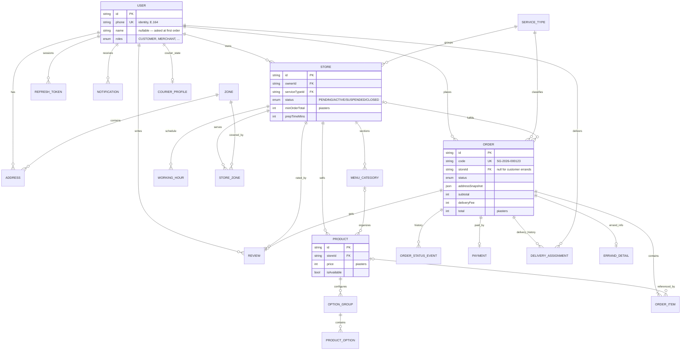
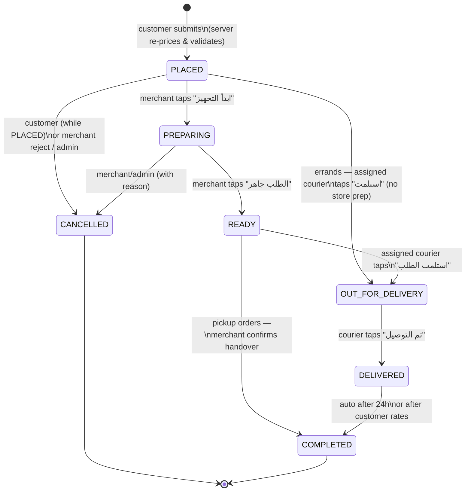

# 02 — Domain Model & ERD

> Status: Draft v0.1 • Last updated: 2026-07-29
> Field-level truth lives in [03-database-schema.md](03-database-schema.md) (Prisma schema). This doc explains the *shape and the why*.

## 1. Bounded contexts (= NestJS modules = frontend features)

| Context | Owns | Key rule |
|---------|------|----------|
| `identity` | User, OtpRequest, RefreshToken, DeviceToken | Phone is the identity. Multi-role users. |
| `catalog` | ServiceType, Store, WorkingHour, MenuCategory, Product, OptionGroup, ProductOption | Public reads are cacheable; merchants edit only their own store. |
| `geo` | Zone, StoreZone, Address | Every deliverable order resolves to a zone → fee + ETA. |
| `ordering` | Order, OrderItem, OrderStatusEvent, ErrandDetail | The core aggregate (catalog orders **and** errands). Immutable snapshots. Server-priced. |
| `engagement` | Review, Notification | One review per delivered order. |
| `payments` (P2) | Payment | Provider-agnostic records; COD needs no row. |
| `delivery` | DeliveryAssignment, CourierProfile | Platform courier workflow (MVP, ADR-009): dispatch → pickup → delivered + cash rules (ADR-011). |
| `platform` | AuditLog, admin ops | Append-only audit. |

Contexts reference each other **by ID only** — no cross-context joins in application code outside read-model queries. This keeps future service extraction mechanical.

## 2. ERD (core relations)

## 3. Non-obvious modeling decisions (the "why")

**Money = integer piasters everywhere.** No floats, no `Decimal` arithmetic in JS. `12550` = ١٢٥٫٥٠ جنيه. Formatting is a UI concern (`@sprintgo/shared` helper).

**Orders snapshot everything.** `OrderItem` copies `name`, `unitPrice`, and selected options into the row (JSONB); `Order` copies the delivery address into `addressSnapshot`. A merchant renaming a product or a customer editing an address must never rewrite history. `productId` stays as a nullable reference for analytics only.

**Soft delete for catalog, never for orders.** `Product`/`Store`/`Address` get `deletedAt`; orders are permanent.

**`ServiceType` is data, not code.** Verticals carry a JSONB `config` validated by a Zod schema (`ServiceTypeConfig`). Adding "صيدليات" is an INSERT, not a migration. See [07-service-extensibility](07-service-extensibility.md).

**Errands (مشوار) reuse the Order aggregate (ADR-010).** An errand is an `Order` on a `ServiceType` whose `flowType = ERRAND`, plus a satellite `ErrandDetail` row (pickup description, instructions, recipient snapshot, purchase budget, cash to collect). `Order.storeId` is therefore **nullable**: customer errands have no store; merchant-initiated delivery requests set `storeId` to the requesting store (pickup = the store) and put the — possibly non-user — recipient in `ErrandDetail`. One aggregate ⇒ one tracking screen, one dispatch board, one audit trail for every kind of delivery.

**Delivery is platform-owned (ADR-009).** `DeliveryAssignment` links an order to a courier; `CourierProfile` carries availability. Assignment is a **parallel track** to order status — assigning a courier never mutates `Order.status`; the courier's *pickup* does (→ `OUT_FOR_DELIVERY`). Reassignment cancels the active assignment row and creates a new one (history preserved); a partial unique index guarantees at most one active courier per order.

**One review per order** (`orderId` unique) — review rights derive from a real delivered order; store rating aggregates (`ratingAvg`, `ratingCount`) are denormalized counters updated in the same transaction.

**Multi-role users.** `roles Role[]` on `User`. Same phone can be customer + merchant. The active context is a UI concern; authorization always checks the required role per endpoint.

**Zones over polygons (MVP).** `Zone` is a named area (حي/منطقة); a store serves zones through `StoreZone { deliveryFee, etaMins }`. Customers pick their zone once per address. Geo-polygons/geocoding are a Phase 3 refinement — elderly users understand "المعادي" better than map pins anyway (a map is offered, never required).

## 4. Order lifecycle — the platform's heartbeat

### Transition authorization matrix

| From → To | Customer | Merchant | Courier | Admin | System |
|-----------|:--------:|:--------:|:-------:|:-----:|:------:|
| PLACED → PREPARING (catalog) | — | ✓ | — | ✓ | — |
| PLACED → OUT_FOR_DELIVERY (errand) | — | — | ✓ (assigned) | ✓ | — |
| PLACED → CANCELLED | ✓ (own, while PLACED) | ✓ (reject + reason) | — | ✓ | ✓ (catalog: auto-cancel if unacknowledged 15 min → customer notified) |
| PREPARING → READY | — | ✓ | — | ✓ | — |
| PREPARING → CANCELLED | — | ✓ (reason required) | — | ✓ | — |
| READY → OUT_FOR_DELIVERY | — | — | ✓ (assigned) | ✓ | — |
| READY → COMPLETED (pickup) | — | ✓ (handover) | — | ✓ | — |
| OUT_FOR_DELIVERY → DELIVERED | — | — | ✓ (assigned) | ✓ | — |
| DELIVERED → COMPLETED | ✓ (by rating) | — | — | ✓ | ✓ (24h auto) |

Courier transitions additionally require an **active `DeliveryAssignment`** for that courier on that order — enforced by the same transitions service, never by the UI alone.

Rules enforced in **one place**: a transition map in `@sprintgo/shared` (`ORDER_TRANSITIONS`) consumed by the backend guard, the merchant board buttons, and tests. Every transition writes an `OrderStatusEvent { from, to, actorId, actorRole, note }` — the audit trail and the customer-facing timeline are the same data.

Customer-facing status labels (defined once in `@sprintgo/shared`, used by UI + notifications):

| Status | Label (ar-EG) |
|--------|---------------|
| PLACED | استلمنا طلبك ✓ |
| PREPARING | المحل بيجهّز طلبك |
| READY | طلبك جاهز |
| OUT_FOR_DELIVERY | طلبك في الطريق إليك |
| DELIVERED | تم التوصيل — بالهنا! |
| CANCELLED | الطلب اتلغى |

Labels are **flow-aware**: the ERRAND flow overrides copy for the same statuses (`PLACED` → "بندوّر لك على مندوب", `OUT_FOR_DELIVERY` → "المندوب استلم وجاي لك"). One `statusLabel(flowType, status)` helper in `@sprintgo/shared` serves UI + notifications. Courier assignment itself is not an order status — the tracking timeline renders it from the assignment record ("تم تعيين مندوب: أحمد").

## 5. Future improvements

- `FlowType.BOOKING` verticals add a `Booking` satellite entity (slot, duration) beside `Order` — the strategy layer isolates this ([07](07-service-extensibility.md)).
- If per-store staff accounts are needed: `StoreMember { storeId, userId, storeRole }` — designed, not built.
- Courier location pings live in Redis (TTL), never Postgres.
