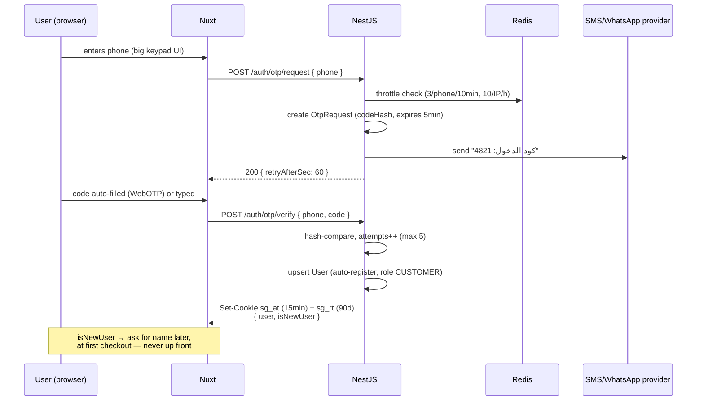

# 05 — Authentication & RBAC

> Status: Draft v0.1 • Last updated: 2026-07-29
> Related: [04-api-contract](04-api-contract.md) • [09-security](09-security.md) • ADR-002/003 in [11-decisions-adr](11-decisions-adr.md)

## 1. Design goal

**Login must never be the reason an elderly user fails to order.** Consequences:

- Customers: **passwordless** — phone + OTP only. No passwords to forget, no emails, no usernames.
- Sessions are **long** (sliding 90-day refresh) — a returning customer effectively never logs in again.
- Browsing is **guest-first**: login is requested only at checkout, with the cart preserved.
- OTP is **4 digits** (easier to read from an SMS and retype), compensated by strict attempt/rate limits (ADR-002). WebOTP API auto-fills it on Android/Chrome so most users never type it at all.
- Merchants/admins additionally have passwords (they access money-relevant panels); admins get OTP as a second factor.
- Couriers are field staff: OTP-only login like customers; accounts created by admins ([ADR-009](11-decisions-adr.md)).

## 2. Customer OTP flow

## 3. Token strategy

| Token | Form | Lifetime | Storage | Notes |
|-------|------|----------|---------|-------|
| Access `sg_at` | JWT (HS256 → RS256 when a second consumer appears) | 15 min | httpOnly, Secure, SameSite=Lax cookie | Claims: `sub`, `roles`, `jti`. **No storeId claim** — ownership resolved server-side (no stale-claim bugs) |
| Refresh `sg_rt` | Opaque 256-bit random | 90 days sliding | httpOnly cookie, path=/api/v1/auth | DB row stores `sha256(token)` + `familyId` |

**Rotation with reuse detection:** every `/auth/refresh` issues a new pair and marks the old row `rotatedAt`. If a token that was already rotated is presented again (theft indicator), the whole `familyId` is revoked and the user re-authenticates. Standard OWASP guidance, implemented in one service.

**Why cookies, not localStorage:** XSS cannot exfiltrate httpOnly cookies; single-origin deployment (nginx) makes them work with zero CORS. CSRF is neutralized by `SameSite=Lax` + origin check + no state-changing GETs ([09-security](09-security.md)).

## 4. Roles & permission model

Roles are a **closed enum** (`CUSTOMER, MERCHANT, COURIER, ADMIN, SUPER_ADMIN`); permissions are **code-defined constants** mapped to roles in `@sprintgo/shared` — type-safe, reviewable in PRs, testable. A DB-driven permission editor is deliberately deferred (YAGNI; adds an admin attack surface).

Enforcement layers in NestJS — every protected route passes through all three:

1. `JwtAuthGuard` — authenticates, attaches `request.user`.
2. `RolesGuard` + `@Roles(Role.MERCHANT)` decorator — coarse role check.
3. **Ownership policies** (the layer that actually prevents IDOR): services scope every query by the authenticated principal — merchant queries are `where: { store: { ownerId: user.id } }`, customer queries `where: { customerId: user.id }`, courier queries are scoped to an **active assignment** (`assignments: { some: { courierId: user.id, status: { in: [ASSIGNED, PICKED_UP] } } }`). Ownership is *in the query*, not an afterthought `if`.

## 5. Permission matrix

✓ = allowed · **own** = only own records · — = denied

| Capability | CUSTOMER | MERCHANT | COURIER | ADMIN | SUPER_ADMIN |
|---|:--:|:--:|:--:|:--:|:--:|
| Browse catalog (public) | ✓ | ✓ | ✓ | ✓ | ✓ |
| Manage own profile/addresses | own | own | own | own | own |
| Place order / errand | own | own¹ | — | ✓² | ✓ |
| Create store delivery request | — | own store | — | ✓ | ✓ |
| Cancel order (while PLACED) | own | own store (reject) | — | ✓² | ✓ |
| View orders | own | own store | assigned | ✓ | ✓ |
| Merchant transitions (accept/reject/ready/handover) | — | own store | — | ✓ | ✓ |
| Courier transitions (pickup/delivered/goods-cost) | — | — | assigned | ✓ | ✓ |
| Toggle courier availability | — | — | own | ✓ | ✓ |
| Assign / reassign couriers (dispatch) | — | — | — | ✓ | ✓ |
| Review order | own delivered | — | — | — | — |
| Reply to reviews | — | own store | — | ✓ | ✓ |
| Manage products/categories/hours/zones | — | own store | — | ✓ | ✓ |
| Toggle store open/closed | — | own store | — | ✓ | ✓ |
| Approve/suspend stores | — | — | — | ✓ | ✓ |
| Manage service types & zones | — | — | — | ✓ | ✓ |
| Create merchant/courier accounts | — | — | — | ✓ | ✓ |
| Block users | — | — | — | ✓ | ✓ |
| Read audit logs | — | — | — | ✓ | ✓ |
| Manage admin accounts | — | — | — | — | ✓ |

¹ a merchant ordering as a customer acts under their CUSTOMER role — same account.
² admin cancellations always require a reason and are audit-logged.

## 6. Account lifecycle & edge rules

- **Blocking** (`UserStatus.BLOCKED`) kills all refresh-token families immediately; access tokens die ≤ 15 min later (accepted window; a Redis denylist by `jti` is the ready upgrade if instant revocation is ever required).
- **Phone change**: OTP-verify the *new* number, keep the old as audit metadata. (Deferred UI; support-assisted at MVP.)
- **Merchant & courier onboarding**: admin creates the accounts (assisted onboarding — see [04 §4.6](04-api-contract.md)); they receive an SMS and log in with OTP; passwords optional for merchants, none for couriers.
- **Deletion requests**: soft-block + PII anonymization job (name → null, phone → tombstone hash) while preserving order/financial history — see PII policy in [09-security](09-security.md).

## 7. Future improvements

- WhatsApp OTP channel (higher delivery rates in Egypt) behind the same `OtpChannel` interface.
- Passkeys for admins.
- `StoreMember` table for merchant staff accounts with per-store roles (cashier vs owner).
